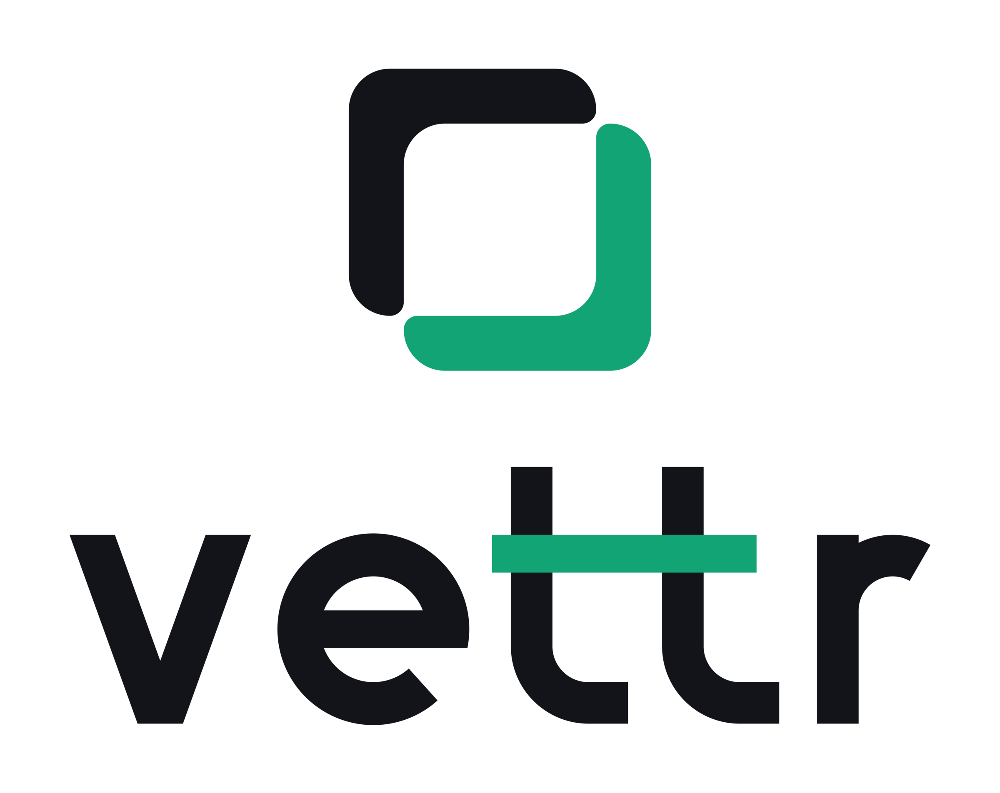
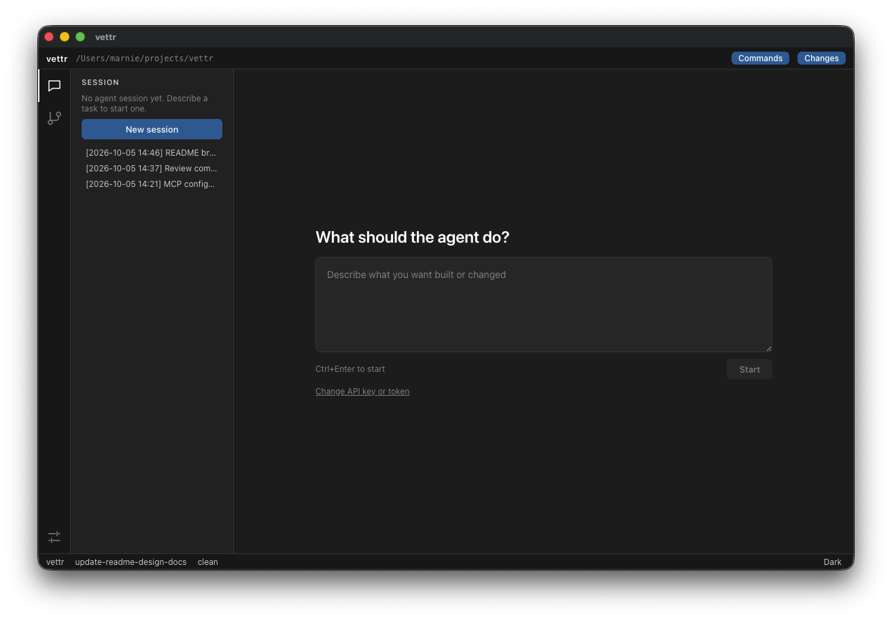
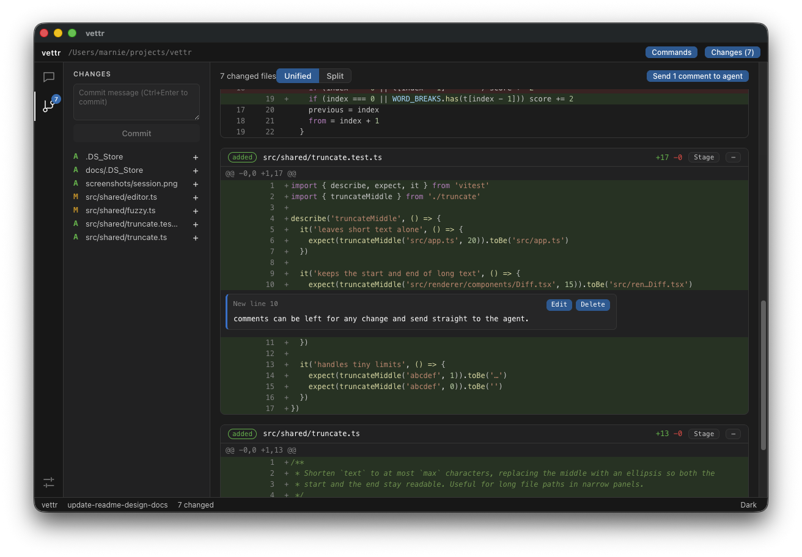

<p align="center">
  <picture>
    <source media="(prefers-color-scheme: dark)" srcset="branding/png/vettr-stacked-on-dark.png">
    
  </picture>
</p>

<p align="center"><strong>Prompt. Watch. Review. Ship.</strong><br>An agent-first review IDE: work on a repository through agents, and vet every change before it lands.</p>

---

## What is vettr?

vettr (pronounced "vetter": to vet a change is to check it carefully) is a native desktop app for working on a code repository through coding agents instead of an editor. Think of it as GitHub Desktop with an agent built in. You never browse a file tree to find out what happened. You describe what you want, review the result like a pull request, and send your comments back to the agent until it is right.

<!-- Screenshot: the Session view with a prompt and streamed agent output -->
<p align="center"></p>

## How it works

1. **Open a project.** Pick any git repository from the File menu. vettr reopens your last project on launch.
2. **Prompt.** Describe what you want in the Session view. The agent (Claude, via the Claude Agent SDK) runs inside a Docker sandbox with your project mounted, so it can work freely without touching the rest of your machine.
3. **Watch.** Follow along as the agent streams its reasoning, tool calls and file edits. Stop it at any time or send follow-ups. Sessions are saved and can be resumed later.
4. **Review.** Open the Changes view for a pull-request-style diff of your working tree against `HEAD`, in unified or split mode. It updates live as files change.

   <!-- Screenshot: the Changes view with a diff and line comments -->
   <p align="center"></p>

5. **Comment.** Click a line number (shift-click for a range) to leave a comment. Batch them up and send them to the agent as a structured review. Comments follow their code between rounds, and a "Since last review" diff shows exactly what the agent changed in response.
6. **Repeat** until the changes are right. Need to edit by hand? Open any file in your own editor at the right line.
7. **Commit and push.** Stage files, write your message, commit and push. These are always your actions: the agent has no git credentials and cannot change history.

A VS Code-style command palette (Ctrl+Shift+P) covers everyday git: fetch, pull, branches, stash, merge and rebase.

## Safe by design

- Agents run in a Docker sandbox with full permissions inside it, so there are no approval prompts to click through.
- Git is read-only to the agent: `.git` is mounted read-only and no credentials enter the container.
- Your API key is stored in the OS keychain and passed to the sandbox over stdin, never through the environment or a file. You can save several named keys or tokens ("Work", "Personal") as profiles and switch between them in Settings; the profile in use is shown in the top bar and applies to that vettr instance only. A key is never shown again once saved.
- The agent starts as soon as you open a project, so your first prompt does not wait for the sandbox. Until it is ready (or if Docker or a key is missing) the prompt and comment inputs are disabled, with the reason shown.

Docker is required. Linux is the first supported platform.

## Getting started

You need [Rust](https://rustup.rs) (stable) and Docker.

```sh
cd runner && npm install && npm run build:sandbox && cd ..   # builds the vettr-sandbox Docker image
cargo run --release
packaging/linux/install-desktop.sh   # Linux: installs the icon and desktop entry so the window shows the vettr logo
```

The app also builds the sandbox image on first run if it is missing, as long as the runner bundle (`runner/dist/runner.mjs`) has been built.

Run the tests with:

```sh
cargo test              # the app
cd runner && npm test   # the sandbox runner
```

## Project layout

- `src`: the Rust app (`ui` for the egui interface, `host` for git, Docker, file watching and stores)
- `runner`: runs inside the sandbox container and drives the Agent SDK (TypeScript)
- `sandbox`: Dockerfile for the agent sandbox image
- `branding`: logos, icons and usage guidelines ([branding/README.md](branding/README.md))
- `docs`: [project brief](docs/PROJECT_BRIEF.md) and [design documents](docs/designs/README.md)

## Contributing

Design and technical decisions live in [docs/PROJECT_BRIEF.md](docs/PROJECT_BRIEF.md) and [docs/designs](docs/designs/README.md), not in this file.
